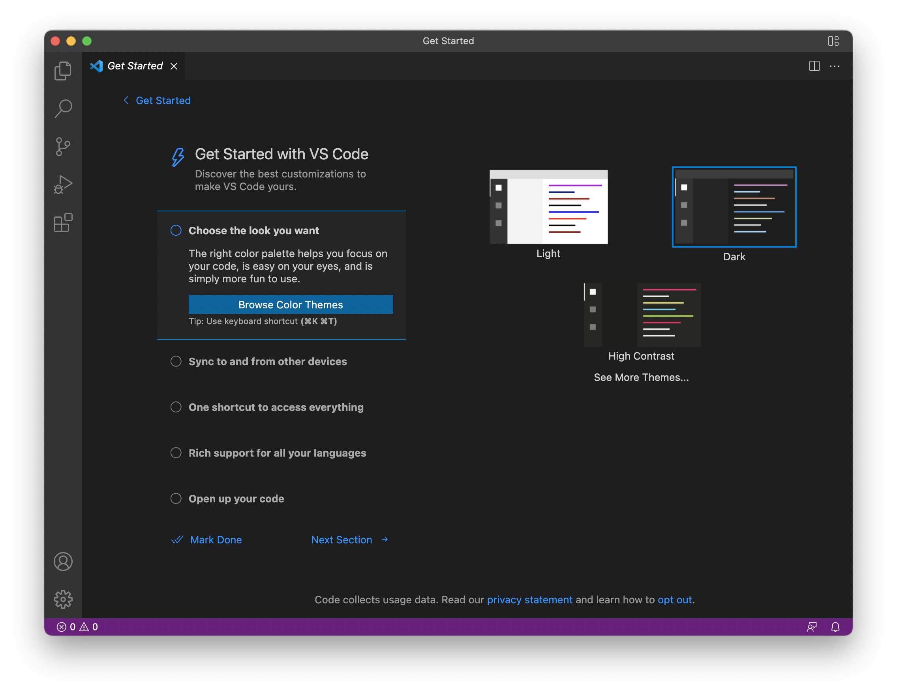
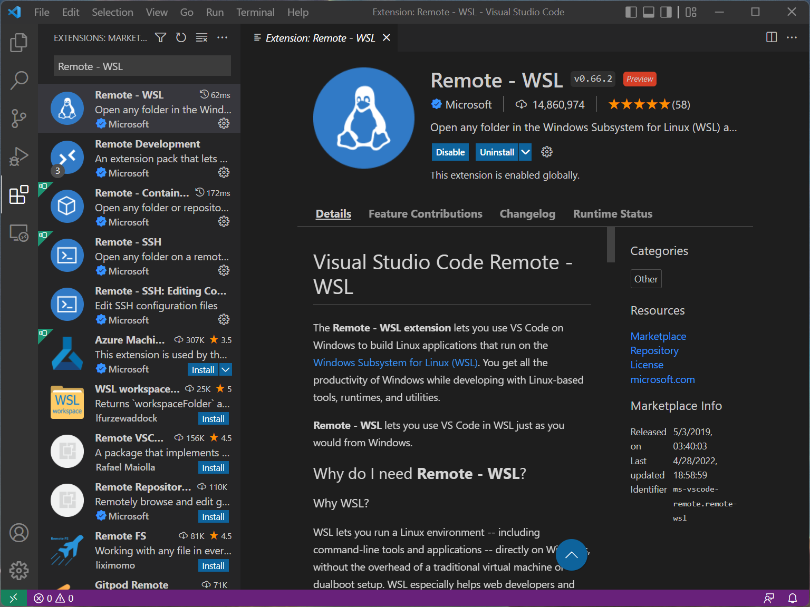
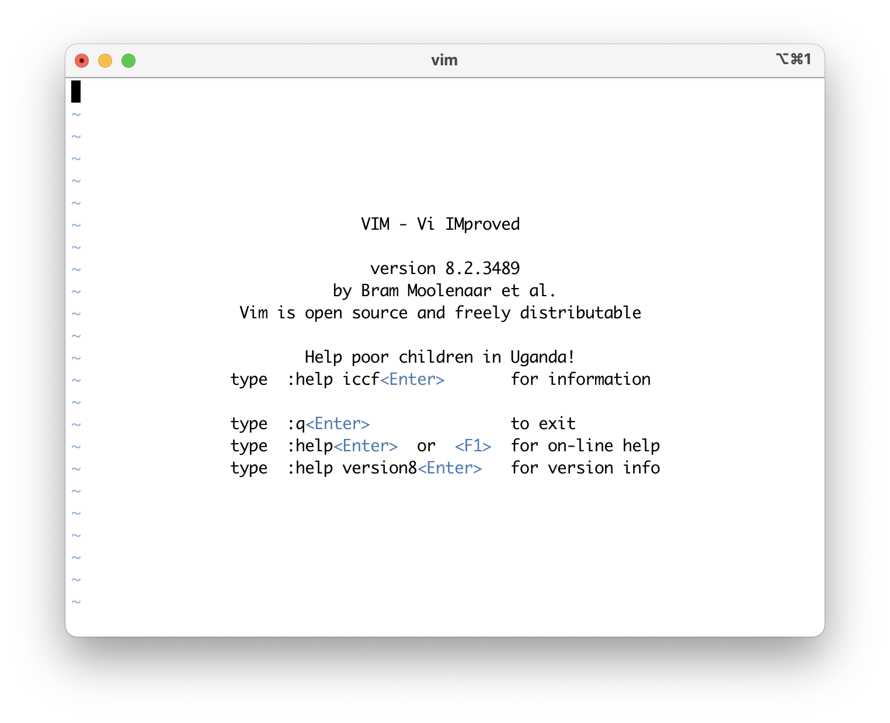

# エディターのインストール

エディター(editor)はプログラムを書くためのソフトウェアです.
Windowsのメモ帳などもeditorの一種ですが, もう少し高級なソフトウェアはプログラムを書くことを支援する機能が含まれています.
プログラムの文法に従って色がついたり(syntax highlight), 補完機能が使えたりします.
ROOT講習会のためにどれかひとつインストールして, 使えるようにしておいてください.

## VSCode
最近人気のeditorで, 最初のeditorとしておすすめです.

Windowsでは, [ここ](https://azure.microsoft.com/ja-jp/products/visual-studio-code/)からダウンロードできます.
Macでは, homebrewがインストールされていれば, `brew install --cask visual-studio-code` でインストールできます.
### 初期設定
インストールしたままの状態のVSCodeでも問題なく使うことはできますが、各種設定をこなすことでVSCodeの強力な支援機能の恩恵を受けることができます。
#### WSL上でVSCodeを使う (Windowsの方)
WSL上のファイルを開くために拡張機能をインストールします。
VSCodeのウィンドウの左側にアイコンがいくつか並んでいます。そのうちの四角形が4つ並んでいるアイコンをクリックしてWSLと検索します。おそらく一番上に出てくる拡張機能 "Remote - WSL" をインストールします。
正常にインストールできていれば、コマンドパレットから`Remote-WSL: New WSL Window`を実行することでVSCodeからWSL環境に入ることができると思います。


#### ShellにVSCodeのパスを通す
コマンドライン上からVSCodeを起動するためにパスを通します。
VSCodeを起動してCtrl (Cmd) + Shift + Pでコマンドパレットを開きます。コマンドパレットではVSCodeの各種操作をマウスを使うことなく実行できます。コマンドパレット上で shell と検索し`Shell Command: Install 'code' command in PATH`を実行します。これでパスが通ったので再度コマンドパレットを起動し`Terminal: Focus on Terminal View`を実行してVSCode内でターミナルを起動します。
```
code test.txt
```
と入力し、VSCodeウィンドウ内で新規ファイルが作成されたらパスが通っています。
#### フォルダを開く
VSCodeにはフォルダを開く、という機能がありフォルダごとに設定を管理しています。
作業フォルダを事前に作成しておき、そのフォルダを開きましょう。


## Atom

## Vim (vi)
私(@mzks)が普段使っているエディターで, 長い歴史のあるエディターです.

最初は操作が難しいですが, 慣れれば非常に効率よく編集を行うことができます.
また, terminal上で動くので, editor画面を改めて立ち上げる必要がありません.
インストールは, WSL上であれば, `apt install vim`, Macでは`brew install vim`で入ります.
初めから入っていることも多いです.
`vimtutor`や`vimtutor -g ja`(日本語)というコマンドで, チュートリアルが起動します.

## Emacs
Vimと双璧をなすエディターであり, こちらも低くない学習コストを要求しますが, ショートカットを使いこなせば, 高い編集効率を得られることに定評があります.
