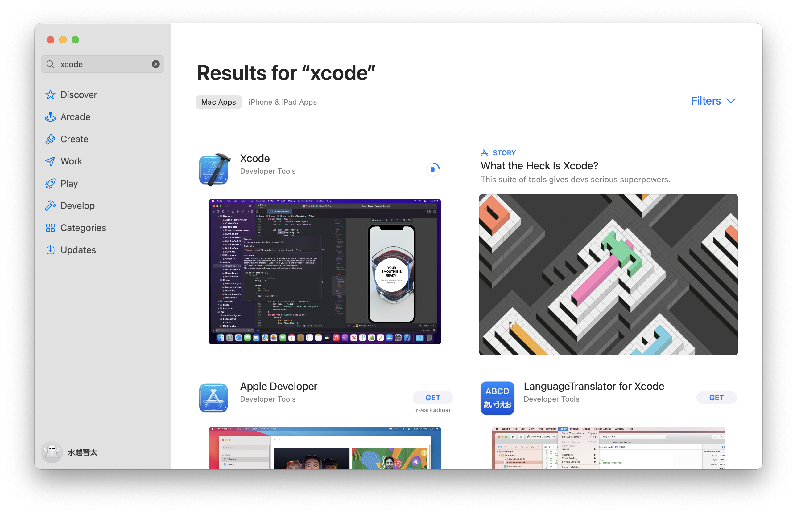
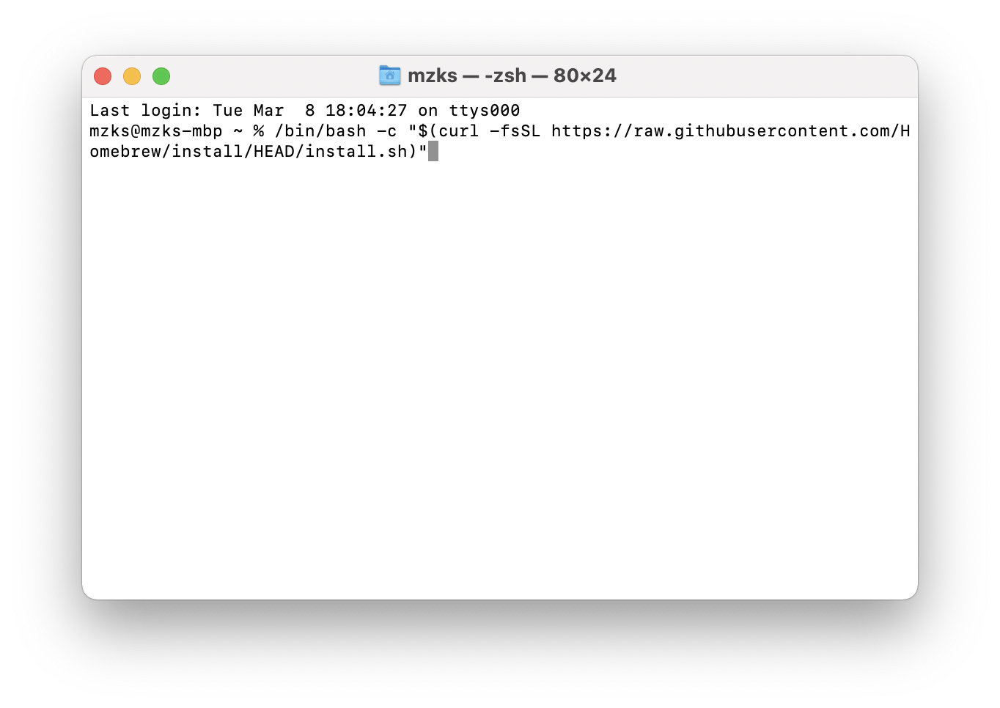

# MacでのROOTのインストール
* [インストール向け資料](./materials/root_lec_mzks_install.pdf)

Mac上でROOTをビルド(コンパイル)します.
難度はやや高めです.

 ## ソフトウェアアップデートとXCodeのインストール
**まず, Mac のソフトウェアアップデートを行なってください.**
次に, AppStoreからXCodeをインストールし, 起動します. 
最初はLicenceの承諾を要求されるので, 認めてください.


 ## homebrewのインストール
homebrewはpackage managerと呼ばれるソフトウェアのひとつで, 様々なソフトウェアをインストール, 管理するのに用います.
今回は, ROOTのインストールに必要なソフトウェアをインストールするために使います.
Macのアプリケーションで, terminal.app (ターミナル.app)を起動してください.
起動すると文字が打ち込める画面が出てきます.
ここに命令を書いて, Enterキーを押すことでコンピューターに指示を与えることができます.
homebrewをインストールするために, 下の一文をコピー&ペーストして, Enter キーを押してください.
```
/bin/bash -c "$(curl -fsSL https://raw.githubusercontent.com/Homebrew/install/HEAD/install.sh)"
```

一旦実施することが説明され, 停止します.
Enterキーをおすと, homebrewのインストールが始まります. 
途中, Macのユーザーのパスワードを聞かれるので, 入力してください.
インストールが終わると, 最後の設定についての指示がされます.
指示に従って, 以下の二行をコピー&ペーストしてそれぞれEnterキーを押して実行してください.
```
echo 'eval "$(/opt/homebrew/bin/brew shellenv)"' >> ~/.zprofile
eval "$(/opt/homebrew/bin/brew shellenv)"
```
これでhomebrewのインストールは完了です.
`brew doctor`と打つと正しくインストールできているか確認できます.
正しくインストールできていれば,特に怒られないメッセージが出るはずです.

 ## ROOTに必要なソフトウェアのインストール
homebrewが入っていれば, 簡単にインストールすることができます.
以下のコマンドを実行してください.
```
brew install gcc cmake
brew install --cask xquartz
```

 ## (Option) homebrewでのROOTのインストール
ここまでうまくできていれば, 実は`brew install root`を実行することでROOTをインストールすることができます.
最初は, この後の方法でインストールすることをお勧めします.
もしどうしてもインストールできなければ, このコマンドを試してください.

 ## (Option) pythonの設定
pythonはmacであればすでにインストールされています.
以下のコマンドで, numpyなど, 基本的なツールをインストールしてください.
```
python3 -m pip install --upgrade pip setuptools wheel
python3 -m pip install numpy scipy matplotlib pandas
```

`python3`と打つとpythonが起動します.

以下は上級者向けのコメントなので, 初心者はこの項目を読み飛ばしてください.
とりあえずbuilt-in pythonを使いますが, 適宜好きなpythonを使って構いません.
```
brew install python3
```
などとするのであれば, PATHの設定をして/opt/homebrew 以下のpython3をcmakeから見えるようにしておく必要があります.
私の環境では特に何もする必要がありませんでしたが, 必要があれば, `.zprofile`に
```
eval "$(/opt/homebrew/bin/brew shellenv)"
export PATH=/opt/homebrew/opt/python@3.9/libexec/bin:$PATH
```
などと追記する必要があるかもしれません.
`python3 -m pip install --upgrade pip setuptools wheel` や, `python3 -m pip install numpy`を事前に行っておくのが無難です.


 ## ROOTのインストール
まず, インストール場所を用意します.
```
cd && mkdir root_build && cd root_build
```
ROOTの最新版をダウンロードします.
```
git clone --branch latest-stable --depth=1 https://github.com/root-project/root.git root_src
```

`ls`などのコマンドで今のディレクトリ以下を見ると,`root_src`ができているはずです.
ビルドのための設定をcmakeで行います.
```
cmake -B build -S root_src -DCMAKE_INSTALL_PREFIX=~/local/root/6.26.10
```
最後に, 
```
-- Configuring done
-- Generating done
-- Build files have been written to: /あなたの環境/build
```
などと表示されれば設定完了です.
実際にビルドします.
```
cmake --build build -j4
```
以前は, makeという別のツールを使っていましたが, cmake自体でビルドができるようになっています.
`-j4`はビルドする時の並列数で, コンピューターの性能に応じて適宜増やしてください.
よくわからなければコピペで大丈夫です.

エラーなく終了したら, そのまま, 以下のコマンドで作ったファイルを移動します.
```
cmake --install build
```

 ### 最新Mac OS
 最新のMac OSの更新に伴って, buildが失敗することがあります.
 最新版のソースを代わりに試してみてください.
```
git clone --branch master --depth=1 https://github.com/root-project/root.git root_src
```

 ## PATHを通す
`.zprofile`に, PATHを追記します.
PATHとはコマンドを探してくる場所のリストです.
`.zprofile` に以下を記述して保存してください.
但し, mzksなどのユーザー名は自分のものに適宜読み替えてください.
ファイルがなければ新規作成し, あれば下の方に追記すればOKです.
```
cd /Users/mzks/local/root/6.26.10/bin
source thisroot.sh
cd
```

よくわからなければ, 以下のコマンドを実行してください.
```
cd
echo "cd /Users/mzks/local/root/6.26.10/bin" >> .zprofile
echo "source thisroot.sh" >> .zprofile
echo "cd" >> .zprofile
```

ここで, ターミナルを再起動して, `root`と打ち込んでEnterキーを押し, 以下の出力が出てこれば成功です.
```
   ------------------------------------------------------------------
  | Welcome to ROOT 6.26/10                        https://root.cern |
  | (c) 1995-2021, The ROOT Team; conception: R. Brun, F. Rademakers |
  | Built for macosxarm64 on Mar 03 2022, 06:51:13                   |
  | From tags/v6-26-00@v6-26-10                                      |
  | With Apple clang version 13.0.0 (clang-1300.0.29.30)             |
  | Try '.help', '.demo', '.license', '.credits', '.quit'/'.q'       |
   ------------------------------------------------------------------

root [0]
```

## (おまけ1) Fishを使っている場合.
`~/.config/fish/config.fish`に書く.
```
if status is-interactive
    # Commands to run in interactive sessions can go here
    eval (/opt/homebrew/bin/brew shellenv)

    source /Users/mzks/local/root/6.26.10/bin/thisroot.fish
end
```


